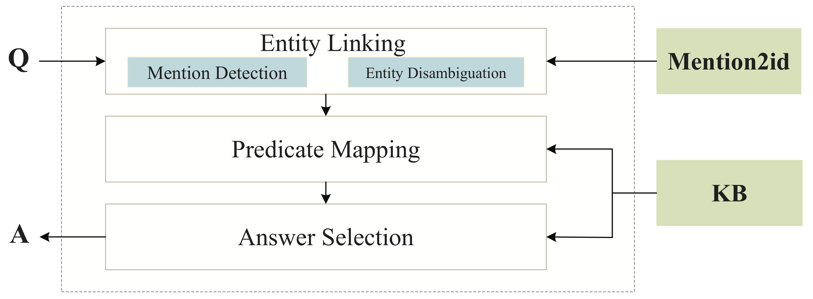
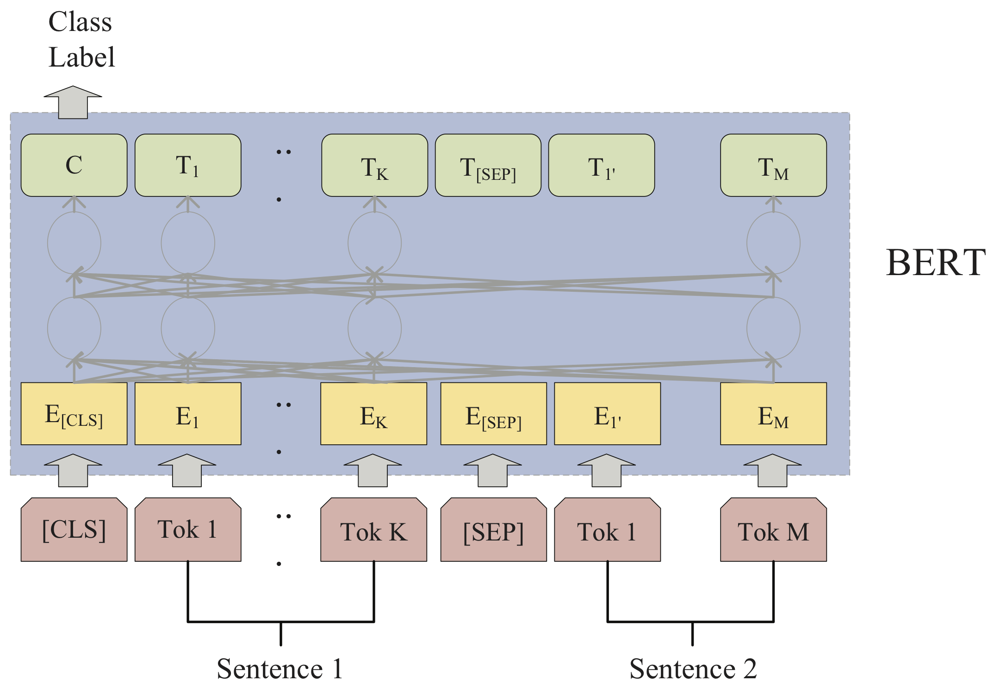
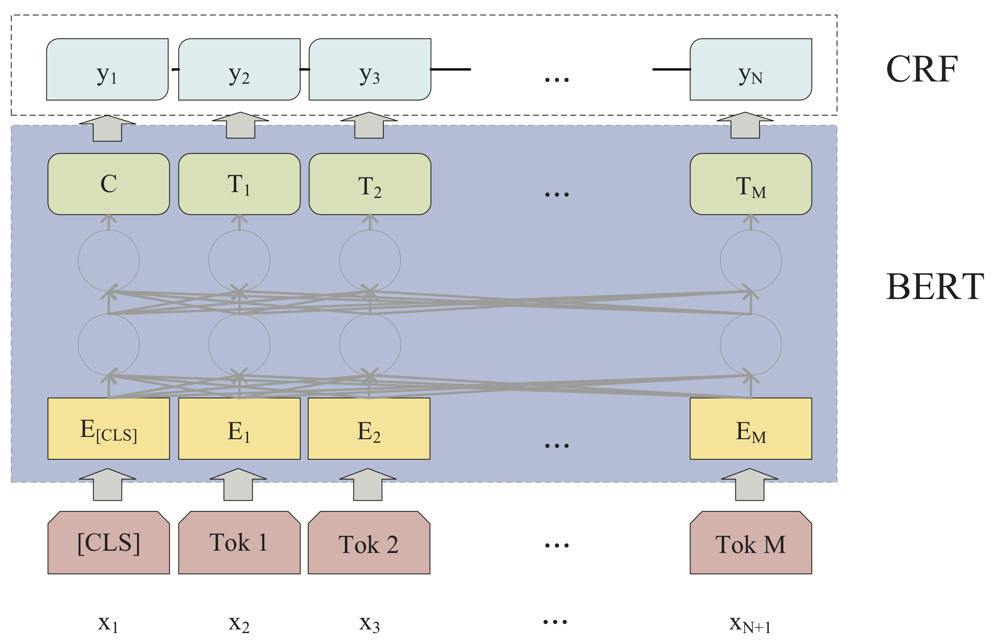

[TOC]

# BB-KBQA



## File change

| file                              | note                                                         |
| --------------------------------- | ------------------------------------------------------------ |
| ner/                              | add BERT-CRF model                                           |
| run_classifier.py                 | add NlpccpmProcessor, NlpccpmwmProcessor and NlpccxqProcessor |
| chinese_L-12_H-768_A-12/vocab.txt | [unused1] 替换为entity                                       |
| data_utils.py                     | 数据预处理                                                   |
| evaluate.py                       | 结果处理                                                     |
|                                   |                                                              |
|                                   |                                                              |
|                                   |                                                              |

**TODO**:  (huangziqi) 加入计算模型结果的代码等其他部分代码


## Model

### BERT

**[`BERT-Base, Chinese`](https://storage.googleapis.com/bert_models/2018_11_03/chinese_L-12_H-768_A-12.zip)**（chinese_L-12_H-768_A-12）:Chinese Simplified and Traditional, 12-layer, 768-hidden, 12-heads, 110M parameters

### BERT-Softmax



### BERT-CRF



## Dataset

| data                            | train  | dev   | test   | infer  |
| ------------------------------- | ------ | ----- | ------ | ------ |
| mention detection               | 13609  | 1000  | 9870   | 9870   |
| entity disambiguation           | 67246  | 5033  | 36219  | 34764  |
| predicate mapping               | 175121 | 10601 | 121960 | 342208 |
| predicate mapping(with mention) | 175121 | 10601 | 121960 | 342208 |


| dataset          | train                         | dev                         | test                                      | infer                                    |
| ---------------- | ----------------------------- | --------------------------- | ----------------------------------------- | ---------------------------------------- |
| md               | MD/train.txt                  | MT/dev.txt                  | MT/test9870.txt                           |                                          |
| ed(raw)          | XQ/candidate_entity_train.txt | XQ/candidate_entity_dev.txt | XQ/candidate_entity_test_bert_9870_mc.txt | XQ/candidate_entity_test_bert_9870.txt   |
| ed               | XQ/train.csv                  | XQ/dev.csv                  | XQ/test9870.csv                           | XQ/infer9870.csv                         |
| pm(raw)          | PM/train.txt                  | PM/dev.txt                  | PM/candidate_predicate_bert_9870_ec.txt   | PM/candidate_predicate_bert_9870_all.txt |
| pm               | PM/train.csv                  | PM/dev.csv                  | PM/test9870.csv                           | PM/infer9870_all.csv                     |
| pm(with mention) | PM/train_with_mention.csv     | PM/dev_with_mention.csv     | PM/test9870_with_mention.csv              | PM/infer9870_all_with_mention.csv        |


## Modules

### mention detection

ner/ : BERT-CRF model

运行下面的命令进行训练或者测试：run_md.sh

```bash
#!/usr/bin/env bash
export BERT_BASE_DIR=./chinese_L-12_H-768_A-12
export MY_DATASET=./data/MD
python run_md.py \
  -do_train \
  -do_eval \
  -do_predict \
  -data_dir $MY_DATASET \
  -vocab_file $BERT_BASE_DIR/vocab.txt \
  -bert_config_file $BERT_BASE_DIR/bert_config.json \
  -init_checkpoint $BERT_BASE_DIR/bert_model.ckpt \
  -max_seq_length 60 \
  -batch_size 32 \
  -learning_rate 1e-5 \
  -num_train_epochs 30 \
  -output_dir ./md_output/ \
  -device_map 1
```

### entity disambiguation

run_classifier.py: 添加NlpccxqProcessor

运行下面的命令进行训练或者测试：run_xq.sh

```bash
#!/usr/bin/env bash
export BERT_BASE_DIR=./chinese_L-12_H-768_A-12
export MY_DATASET=./data/XQ
python run_classifier.py \
  --task_name=nlpccxq \
  --do_train=false \
  --do_eval=false \
  --do_predict=true \
  --data_dir=$MY_DATASET \
  --vocab_file=$BERT_BASE_DIR/vocab.txt \
  --bert_config_file=$BERT_BASE_DIR/bert_config.json \
  --init_checkpoint=$BERT_BASE_DIR/bert_model.ckpt \
  --max_seq_length=60 \
  --train_batch_size=32 \
  --learning_rate=5e-5 \
  --num_train_epochs=3.0 \
  --output_dir=./xq_output/
```

### predicate mapping

run_classifier.py: 添加NlpccpmProcessor, NlpccpmwmProcessor

运行下面的命令进行训练或者测试：run_pm.sh, run_pm_with_mention.sh

```bash
#!/usr/bin/env bash
export BERT_BASE_DIR=./chinese_L-12_H-768_A-12
export MY_DATASET=./data/PM
python run_classifier.py \
  --task_name=nlpccpm \
  --do_train=false \
  --do_eval=false \
  --do_predict=true \
  --data_dir=$MY_DATASET \
  --vocab_file=$BERT_BASE_DIR/vocab.txt \
  --bert_config_file=$BERT_BASE_DIR/bert_config.json \
  --init_checkpoint=$BERT_BASE_DIR/bert_model.ckpt \
  --max_seq_length=40 \
  --train_batch_size=32 \
  --learning_rate=5e-5 \
  --num_train_epochs=3.0 \
  --output_dir=./pm_output/
```

## Results

### NLPCC-ICCPOL 2016 KBQA results (%)

| Models                   | Averaged F1 |
| ------------------------ | ----------- |
| Baseline System (C-DSSM) | 52.47       |
| Wang et al. [15]         | 79.14       |
| Xie et al. [16]          | 79.57       |
| K et al. [17]            | 80.97       |
| Zhou et al. [14]         | 81.06       |
| Yang et al. [13]         | 81.59       |
| Xie et al. [11]          | 82.43       |
| Lai et al. [12]          | 82.47       |
| BB-KBQA                  | **84.12**   |

### Mention detection results (%)

| Models          | F1        |
| --------------- | --------- |
| BiLSTM-CRF      | 90.28     |
| BERT-Softmax    | 96.61     |
| BERT-BiLSTM-CRF | 96.90     |
| BERT-CRF        | **97.34** |

### Entity disambiguation results (%)

| Models              | Accuracy@1 | Accuracy@2 | Accuracy@3 |
| ------------------- | ---------- | ---------- | ---------- |
| BiLSTM-DSSM [19]    | 85.89      | 88.50      | 90.81      |
| Siamese BiLSTM [29] | 87.85      | 92.58      | 94.59      |
| Siamese CNN [30,31] | 88.04      | 92.68      | 94.88      |
| BERT-Softmax        | **89.14**  | **93.19**  | **95.05**  |

### Predicate mapping results (%)

| Models            | Accuracy@1 | Accuracy@2 | Accuracy@3 |
| ----------------- | ---------- | ---------- | ---------- |
| Siamese BiLSTM    | 92.54      | 96.74      | 98.12      |
| Siamese BiLSTM(2) | 93.74      | 97.46      | 98.38      |
| Siamese CNN       | 86.47      | 93.80      | 96.16      |
| Siamese CNN(2)    | 90.61      | 95.57      | 97.01      |
| BERT-Softmax      | **94.81**  | **97.68**  | **98.60**  |
| BERT-Softmax(2)   | 94.66      | 97.63      | 98.41      |


## Reference

```
@article{devlin2018bert,
  title={BERT: Pre-training of Deep Bidirectional Transformers for Language Understanding},
  author={Devlin, Jacob and Chang, Ming-Wei and Lee, Kenton and Toutanova, Kristina},
  journal={arXiv preprint arXiv:1810.04805},
  year={2018}
}
```

- https://github.com/google-research/bert
- https://github.com/macanv/BERT-BiLSTM-CRF-NER

## Contact information

For help or issues using BB-KBQA, please submit a GitHub issue or email (liuaiting@bupt.edu.cn).